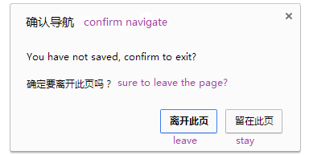

A javascript module, popup a dialog to confirm when exit a page

# Screenshot


# Introduction
```javascript
var ExitConfirm = require('bower_components/exit-confirm/exit-confirm')
var saveFlag = false

// pass a message and a state-confirm function
var handler = new ExitConfirm('You have not saved, confirm to exit?', function () {
	return saveFlag // return false then popup a dialog, otherwise not
})

// open bind
handler.on()

// remove bind
handler.off()

```